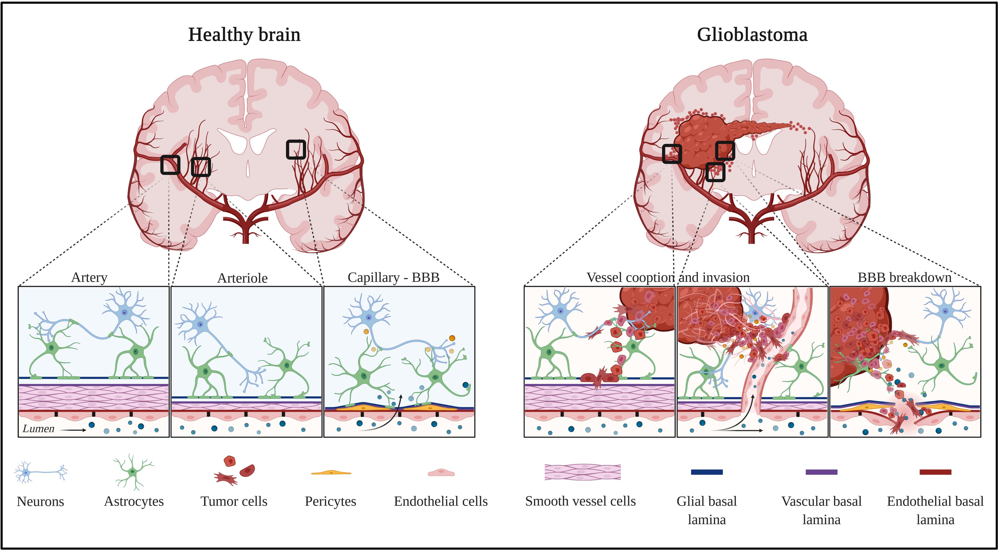

# U-Net-Powered-Brain-MRI-Segmentation-for-Medical-Diagnostics

Brain tumor segmentation is a vital task in medical imaging that assists doctors in identifying and analyzing tumors in MRI scans. This project implements a deep learning solution using a customized U-Net architecture with **EfficientNetB0** as the encoder for **accurate** and **efficient** segmentation. The model is trained on brain MRI images and evaluated using various performance metrics to ensure real-world applicability.

---

## 🛠️ Preprocessing Steps

- **Resizing**: All MRI images and corresponding masks are resized to `224x224`
- **Normalization**: Pixel values are scaled from `[0, 255]` to `[0, 1]`
- **Reshaping**: Grayscale images expanded to `224x224x3` for EfficientNetB0 compatibility

---

## 🔀 Data Splitting

- **Train/Test Split**: 80% training, 20% testing
- **Validation Split**: 10% of training set is used for validation

---

## 🔄 Data Augmentation

To enhance generalization and model robustness:

- **Training Set**:
  - Horizontal Flip
  - Random Rotation (90°)
  - Brightness and Contrast Adjustment
  - Gamma Correction

- **Validation & Test Sets**:
  - Only normalization (no random transformations)

---

## 🧠 Model Details

- **Architecture**: U-Net with EfficientNetB0 Encoder
  - EfficientNetB0 is used as a pre-trained feature extractor
- **Loss Function**: Binary Cross-Entropy (BCE) + Dice Loss
- **Evaluation Metric**: Dice Coefficient (suitable for segmentation tasks)

---

## 🏋️ Training Strategy

- **Optimizer**: Adam (`learning rate = 0.0001`)
- **Batch Size**: 32
- **Epochs**: Up to 50
- **Early Stopping**: Training stops early if validation Dice Coefficient reaches `≥ 0.80` to avoid overfitting

---

## 📊 Evaluation

After training, the model is evaluated on the test set using:

- ✅ Classification Report
- ✅ Confusion Matrix
- ✅ Dice Coefficient

---

## 🧪 Visual Testing on Random Image

To demonstrate model performance visually:

1. Load a random test image and mask
2. Predict the mask using the trained model
3. Apply a threshold of `0.5` to generate a binary mask
4. Compare predicted vs. ground truth
5. Display the original image, predicted mask, and true mask side-by-side

---

## 🔍 Pipeline Diagram

```mermaid
flowchart TD
  A[Start: Brain Tumor Segmentation] --> B[Data Collection]
  B --> B1[Dataset: 3064 Images and Masks]
  B --> B2[Format: Grayscale]
  B --> B3[Dirs: Data/images and Data/masks]

  B3 --> C[Preprocessing]
  C --> C1[Resize to 224x224]
  C --> C2[Normalize to 0-1]
  C --> C3[Expand to 224x224x3]

  C3 --> D[Splitting]
  D --> D1[Train 80%, Test 20%]
  D --> D2[Val: 10% of Train]

  D2 --> E[Augmentation]
  E --> E1[Train: Flip, Rotate, Brightness, Gamma]
  E --> E2[Val/Test: Normalize Only]

  E2 --> F[Model]
  F --> F1[U-Net + EfficientNetB0]
  F --> F2[Loss: BCE + Dice]
  F --> F3[Metric: Dice Coeff.]

  F3 --> G[Training]
  G --> G1[Adam Optimizer]
  G --> G2[Batch Size: 32]
  G --> G3[Early Stop if Dice ≥ 0.80]
  G --> G4[Max Epochs: 50]

  G4 --> H[Evaluation]
  H --> H1[Confusion Matrix]
  H --> H2[Classification Report]
  H --> H3[Dice Coefficient]

  H3 --> I[Visual Testing]
  I --> I1[Predict on Random Image]
  I --> I2[Threshold, Compare, Display]
